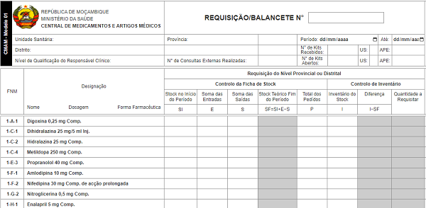

# Totalizador de Requisição/Balancete

O **Totalizador de Requisição/Balancete** é um serviço online gratuito que auxilia na elaboração, como o nome sugere, da requisição/balancete, por meio do *cálculo automático do Stock Teórico Fim do Período, Diferença entre stock teórico e stock físico e Quantidade a Requisitar* com base nos dados de controlo da ficha de stock e inventário preenchidos pelo usuário. Foi criado de acordo com o modelo da ficha de requisição/balancete actualmente vigente no Serviço Nacional de Saúde em Moçambique.

## Objectivos

* Auxiliar os profissionais de saúde no cálculo do Stock Teórico Fim do Período, Diferença entre stock teórico e stock físico e Quantidade a Requisitar com exatidão e prontidão;

* Expandir o acesso à ficha de requsição/balancete.

## O que eu preciso dispor para, e como utilizar o totalizador?

* Um celular ou computador com acesso à internet;

* Ficha(s) de Stock de cada fármaco/artigo médico com os movimentos do mês em alusão.

* E por fim, preencher os movimentos de cada fármaco/artigo médico nas células correspondentes (Stock no Início do Período, Soma das Entradas, Soma das Saídas, Inventário do Stock) e consequentemente os totais (Stock Teórico Fim do Período, Diferença entre stock teórico e stock físico e Quantidade a Requisitar) são, em tempo real, correcta e automaticamente calculados.

## Qual é o destino dos dados que eu insiro?

São guardados no seu celular ou computador, por meio de um recurso chamado [Web Storage](https://developer.mozilla.org/pt-BR/docs/Web/API/Web_Storage_API) e você tem total controle sobre os dados, podendo mantê-los ou apagá-los por meio da opção "Esvaziar ficha" no menu do totalizador ou excluindo os dados de navegação do seu navegador.

## Vantagens do totalizador

* Calcula e preenche automaticamente o Stock Teórico Fim do Período, Diferença entre stock teórico e stock físico e Quantidade a Requisitar;

* Fornece resultados exactos;

* Apresenta essencialmente preenchida a coluna de Designação (Nome, Dosagem e Forma farmacêutica) com os fármacos mais comuns;

* Flexibiliza a elaboração da requisição/balancete;

* Pode ser impresso, inclusive como uma simples ficha de requisição/balancete;

* Pode ser guardado como PDF.